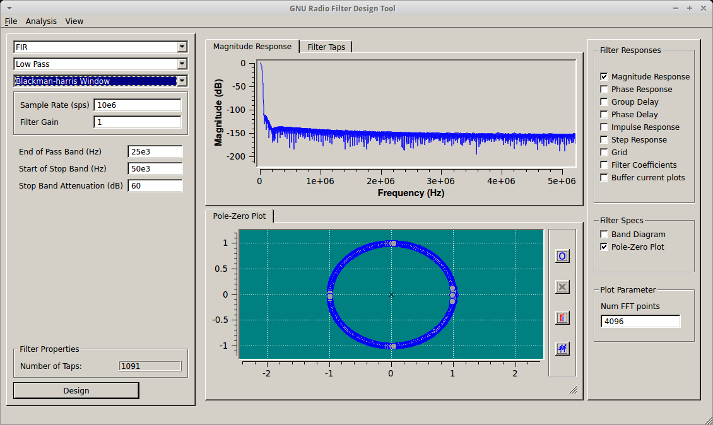
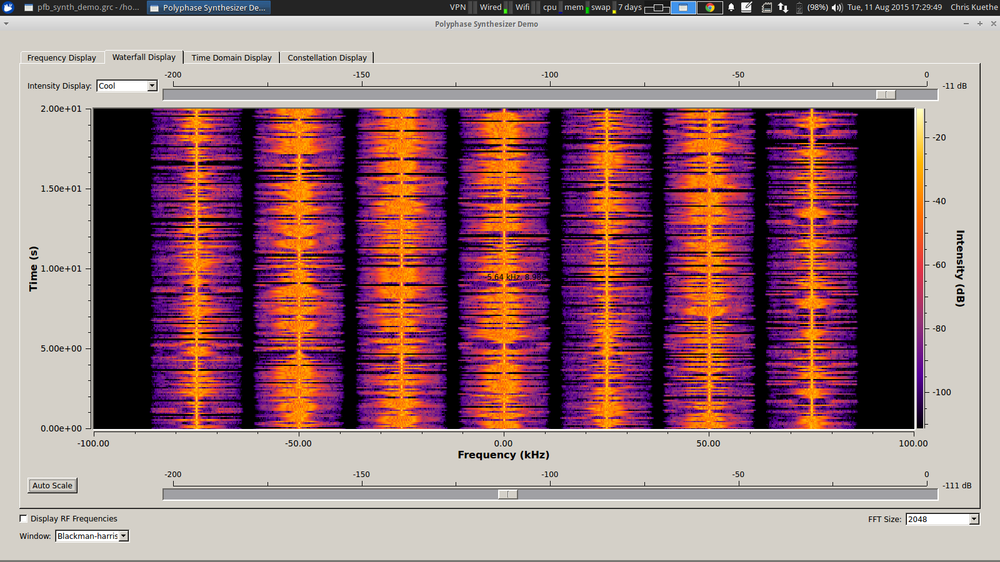
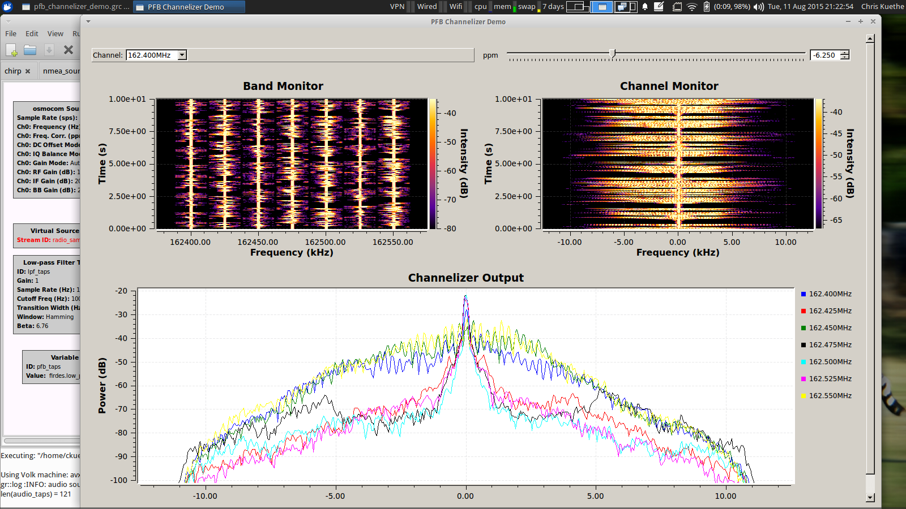

Why Polyphase Filters?
----------------------

Polyphase filters are super nifty, once you figure them out. One good use is to break a large band into a bunch of channels at the same cost as isolating a single channel. Consider a 10MHz band, with 50kHz channel spacings. A naive filter would require almost 1100 taps to extract a single channel. These same taps can be used in the polyphase channelizer, which would then produce 200 channels... or only 55 taps per channel.

About this example
------------------

In this example, we analyze the NOAA weather radio band, consisting of 7 &times; 25kHz channels starting at 162.4MHz. To begin, a sample band with similar characteristics is constructed. The polyphase synthesizer makes this operation nearly trivial compared to an increasingly complicated set of blocks required to combine the channels individually.

Two tools - `pfb_synth_demo_testgen.py` and `pfb_synth_demo_testgen.sh` - are provided to produce distinctive audio signals for each channel, using flite to render simulated weather reports for some airports to wav files. The shell version's output is somewhat less interesting. In either case, channel identification and frequency are embedded in the output to demonstrate that the the system is operating correctly.

    tmp$ ls -l *wav
    -rw------- 1 ckuethe ckuethe 237518 Aug 12 18:29 0_KJFK_slt.wav
    -rw------- 1 ckuethe ckuethe 242890 Aug 12 18:29 1_KMIA_rms.wav
    -rw------- 1 ckuethe ckuethe 222982 Aug 12 18:29 2_KSEA_slt.wav
    -rw------- 1 ckuethe ckuethe 252528 Aug 12 18:29 3_KLAX_rms.wav
    -rw------- 1 ckuethe ckuethe 214134 Aug 12 18:29 4_KDEN_slt.wav
    -rw------- 1 ckuethe ckuethe 248262 Aug 12 18:29 5_PHNL_rms.wav
    -rw------- 1 ckuethe ckuethe 226774 Aug 12 18:29 6_PANC_slt.wav

Some variables are provided to control the modulation (and the audio quality) but they are not strictly necessary for the operation of the synthesizer. Once the band has been synthesized, it can be fed to the channelizer to break out the individual channels again.

The flowgraph for the channelizer has several choices for input to the channelizer:

1. A 200kHz complex stream (such as that produced by the synthesizer demo) can be placed directly on the `filtered_samples` bus.
1. It is also possible to use a higher bandwidth recording, in which case some preliminary filtering and downsampling is required to isolate the target band.
1. Finally, the osmocom source provides a hardware independent method to acquire live signals.

As with the synthesizer demo, the channelizer has a number of tunable options to illustrate the effect of various filters.

Reading List
------------
* http://www.trondeau.com/examples/2014/1/23/pfb-channelizers-and-synthesizers.html
* http://www.trondeau.com/blog/2014/2/27/to-use-or-not-to-use-fft-filters.html
* https://static.squarespace.com/static/543ae9afe4b0c3b808d72acd/543aee1fe4b09162d08633d9/543aee20e4b09162d086354a/1395369129837/rondeau_gr_filtering.pdf
* http://gnuradio.squarespace.com/storage/grcon14/presentations/Sep17_04_Rondeau_pfbs.pdf